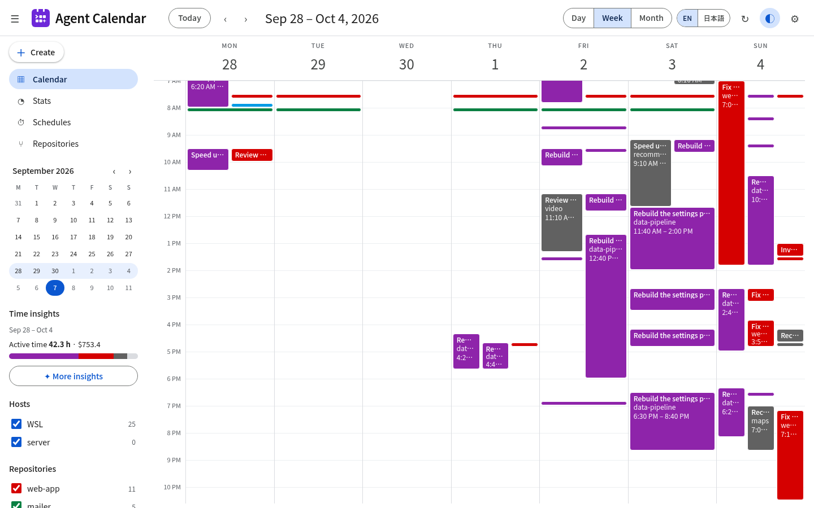
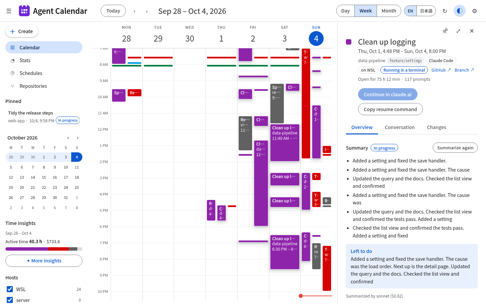
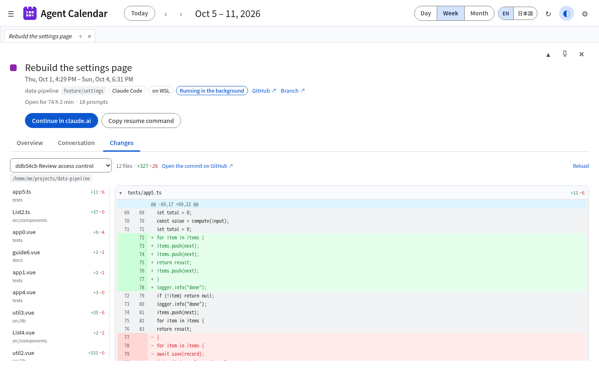
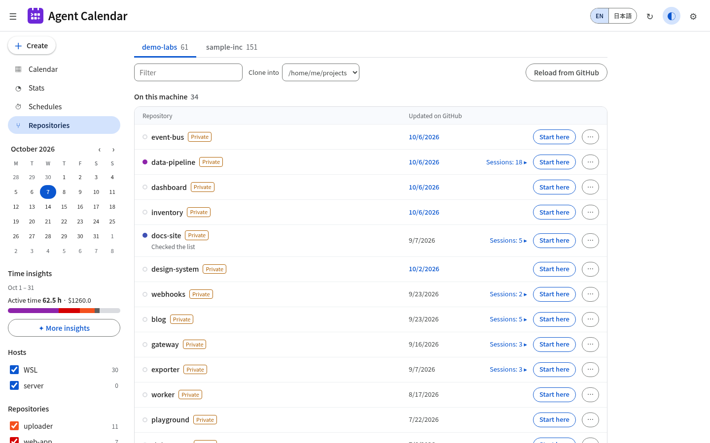
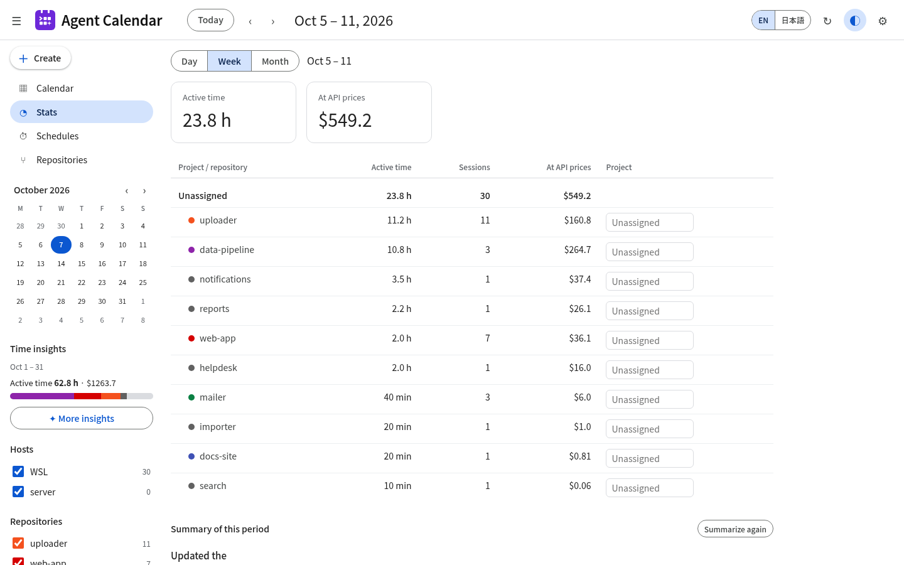

<p align="center"></p>

# agent-calendar

[English](README.md) | [日本語](README.ja.md)

**A local calendar for your AI coding agent sessions.** agent-calendar reads the session transcripts that
[Claude Code](https://docs.claude.com/en/docs/claude-code) and [Codex CLI](https://github.com/openai/codex)
already write to your home directory, and shows them on a day / week / month calendar, with an AI-written
summary of each session, active time and an API-price cost estimate per project, the conversation history,
and ways to continue a session. You can also schedule an agent to run a prompt in a repository at set times.

Everything runs on your machine. The page is served on `127.0.0.1` only.



## What you get

- **Calendar** – day, week and month views in a Google Calendar–style layout. Filter by host and repository.
- **Session details** – summary (what was done, done / in progress / discussion, what is left), cost split into
  agent / subagents / advisor, your git commits made during the session, and the conversation history.
  Summarize a session on demand with *Summarize now*.
- **Stats** – active time, session count and cost per project for a day, week or month. You assign repositories
  to projects in the page.
- **Continue** – send the next instruction to a Claude Code or Codex session from the page (read-only, allowed
  to edit, or Claude's auto mode). When Claude needs approval for a command, the page asks you to allow or deny it.
  You can also resume a Claude Code session in the background with Remote Control, or copy the
  `claude --resume` / `codex resume` command.
- **Schedules** – run a prompt with Claude Code or Codex in a chosen directory once, on chosen weekdays, or every
  N minutes within a time window, optionally in a separate git worktree. Results show up on the calendar.
- **Repositories** – pick a GitHub organization (only the ones you list in Settings) and see its repositories next to
  your local clones (matched by `origin` in the folders you list), when you last worked in each, and when it was last
  updated on GitHub. Start a new Claude Code or Codex session in a clone, or clone a missing one. Uses your `gh` login.
- **Pins** – pin the conversations you are working on; they stay at the top of the sidebar.
- **Screenshots** – paste or drop images (PNG, JPEG, GIF, WebP; up to 5, 5 MB each) into an instruction.
- **Other machines** – collect sessions from another machine over HTTPS (pinned certificate and token) with
  `share` / `remote add`.
- **Screenshot mode** (◐ in the header) – replaces repository names, titles, conversations, paths and diffs with
  sample content while keeping times, counts and costs real, so you can share screenshots. Editing is disabled while it is on.
- English and Japanese UI.

### Screenshots

| Session details | Changes |
|---|---|
|  |  |
| **Repositories** | **Stats** |
|  |  |

The screenshots are taken in screenshot mode, so names and text are sample content.

## Install

Linux (including WSL2) and macOS:

```sh
curl -fsSL https://raw.githubusercontent.com/uiuifree/agent-calendar/main/install.sh | sh
```

This puts `agent-calendar` in `~/.local/bin`. Then, on Linux with systemd:

```sh
agent-calendar service install     # starts a systemd user service
```

or anywhere:

```sh
agent-calendar serve
```

and open <http://127.0.0.1:23848/>.

### Updates

Agent Calendar checks GitHub Releases once a day and shows **Update to vX.Y.Z** in the header when a new version is out.
Clicking it downloads the release for your machine, verifies it against the published sha256, replaces the binary and
restarts the service (when it runs under systemd). Updates never start while an agent is running. You can also turn on
automatic updates in Settings, or run `agent-calendar update` (`--check` to only look). Builds from source are not replaced.

### From source

```sh
git clone https://github.com/uiuifree/agent-calendar && cd agent-calendar
(cd web && npm ci && npm run build)   # the web UI is embedded into the binary
cargo install --path .
```

## Usage

```text
agent-calendar serve [--port 23848] [--no-summarize] [--summary-model sonnet] [--summary-lang en|ja]
agent-calendar scan
agent-calendar summarize [--limit 20] [--model sonnet] [--lang en|ja]
agent-calendar service install [--port 23848] [--no-summarize] [--summary-lang en|ja]
```

`serve` rescans every 5 minutes and summarizes idle sessions every hour (10 per round) between 7:00 and 22:00;
change the hours and intervals from the settings in the page. The summary language defaults to Japanese when `$LANG` starts with `ja`, English otherwise.

## How it works

| Source | Where it reads | Notes |
|---|---|---|
| Claude Code | `~/.claude/projects/*/*.jsonl` | Subagent transcripts (`<session>/subagents/`) count toward the parent's tokens and cost |
| Codex CLI | `~/.codex/sessions/**/rollout-*.jsonl` | Token counts only (no prices); subagent threads are skipped |

- The index lives in `~/.local/share/agent-calendar/agent-calendar.db` (SQLite). Claude Code cleans up old transcripts
  (see its `cleanupPeriodDays` setting); sessions already indexed stay on the calendar.
- Working directories are grouped by git repository, so worktrees count as their main repository.
- **Summaries** are written by `claude -p --no-session-persistence` using your own Claude Code login, so they
  use your Claude plan. Only your prompts and the agent's text replies are sent (no tool input or output).
  Turn them off with `--no-summarize`.
- **Cost** is an estimate at Anthropic API list prices (see `src/pricing.rs`, prices as of 2026-09-25), not your
  subscription bill. It includes advisor calls and subagents. Models without a known price are shown as `+`.
- **Active time** merges 10-minute buckets across sessions; a pause of up to 30 minutes counts as continuous.
  It is the time an agent was running, not your working time.
- **Resume** uses `claude respawn` for sessions that were backgrounded before, and
  `claude --bg --resume <id> --remote-control` otherwise. On Linux it runs inside a `systemd-run --user --scope`
  so restarting the service does not stop the resumed session.

## Security and privacy

- The server binds to `127.0.0.1` and accepts only `Host: 127.0.0.1|localhost|[::1]:<port>`, which blocks DNS
  rebinding. Writes and resume require a JSON body and refuse requests from other origins.
- Transcripts can contain anything you typed. Nothing leaves your machine except the summary requests to
  Anthropic through `claude -p`.

## Compatibility

agent-calendar depends on transcript formats and CLI commands that are not documented as stable APIs
(`~/.claude/projects`, `claude agents --json`, `claude respawn`, `~/.codex/sessions`). Tested with
**Claude Code 2.1.288** and **Codex CLI 0.154.0** on Linux (WSL2). The macOS build is not tested yet.
If a newer version breaks something, please open an issue with the version numbers.

## FAQ

### How do I see what I did with Claude Code last week?

Open the week view and step back a week with the arrow (or press `k`). Each session has a summary written after it went idle.

### How do I track time spent per project with Claude Code or Codex?

Use the Stats view, assign each repository to a project once, and switch between week and month.

### How much would my Claude Code usage cost at API prices?

The Stats view and each session's details show an API-price estimate, split into agent, subagents and advisor.

### Can I resume a Claude Code session from my phone?

Yes. Press "Resume with Remote Control" on the session; it starts in the background on your machine and appears
in the Code list of the Claude app. The button itself is on the local page, so press it from that machine.

### Does it send my transcripts anywhere?

Only for summaries, and only through your own `claude -p`. Use `--no-summarize` to keep everything local.

### Does it work on Windows?

Use it inside WSL2 if you run Claude Code there. Native Windows is not supported.

## Not supported yet

- Prices for Codex (OpenAI) models, Codex subagent threads, Remote Control resume for Codex sessions
- Dark mode

## License

Licensed under either of

- Apache License, Version 2.0 ([LICENSE-APACHE](LICENSE-APACHE) or
  <https://www.apache.org/licenses/LICENSE-2.0>)
- MIT license ([LICENSE-MIT](LICENSE-MIT) or
  <https://opensource.org/licenses/MIT>)

at your option.

### Contribution

Unless you explicitly state otherwise, any contribution intentionally submitted
for inclusion in the work by you, as defined in the Apache-2.0 license, shall
be dual licensed as above, without any additional terms or conditions.

---

agent-calendar is not affiliated with or endorsed by Anthropic, OpenAI or Google. Claude and Claude Code are
trademarks of Anthropic, PBC; Codex is a trademark of OpenAI; Google Calendar is a trademark of Google LLC.
